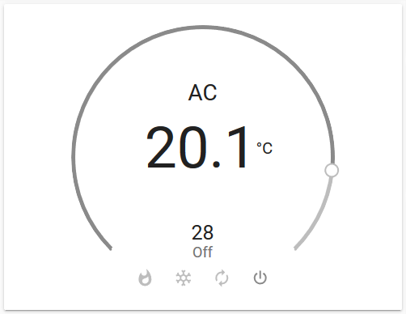

# Xiaomi Mi and Aqara Air Conditioning Companion

This is a custom component for home assistant to integrate the Xiaomi Mi and Aqara Air Conditioning Companion:

| Model ID          | Model number | Product name                            | Shape    |
|-------------------|--------------|-----------------------------------------|----------|
| `acpartner.v1`    | KTBL01LM     | Aqara Air Conditioning Companion        | square   |
| `acaprtner.v2`    | KTBL02LM     | Xiaomi Mi Air Conditioner Companion     | round    |
| `acpartner.v3`    | KTBL11LM     | Aqara Air Conditioning Companion        | square   |

Please follow the instructions on [Retrieving the Access Token](https://www.home-assistant.io/components/vacuum.xiaomi_miio/#retrieving-the-access-token) to get the API token to use in the configuration.yaml file.

Credits: Thanks to [Rytilahti](https://github.com/rytilahti/python-miio) for all the work.

## Features
* Power (on, off)
* Operation Mode (Heat, Cool, Auto, Dehumidify, Ventilate)
* Fan Speed (Low, Medium, High, Auto)
* Swing Mode (On, Off)
* Target Temperature
* Capture and replay infrared commands
* Attributes
  - ac_model
  - ac_power (on, off)
  - load_power (Wh)
  - operation_mode
  - fan_speed
  - swing_mode

## Setup

```yaml
# configuration.yaml

climate:
  - platform: xiaomi_miio_airconditioningcompanion
    name: Aqara Air Conditioning Companion
    host: 192.168.130.71
    token: b7c4a758c251955d2c24b1d9e41ce47d
    target_sensor: sensor.temperature_158d0001f53706
    scan_interval: 60
```



## Debugging

If the custom component doesn't work out of the box for your device please update your configuration to enable a higher log level:

```yaml
# configuration.yaml

logger:
  default: warn
  logs:
    custom_components.xiaomi_miio_airconditioningcompanion.climate: debug
    miio: debug
```

## Platform services

#### Service `climate.xiaomi_miio_learn_command`

Capture an infrared command.

| Service data attribute    | Optional | Description                                                          |
|---------------------------|----------|----------------------------------------------------------------------|
| `entity_id`               |      yes | Only act on a specific air purifier. Else targets all.               |
| `slot`                    |      yes | Storage slot. Defaults to slot ID 30.                                |
| `timeout`                 |      yes | Capturing timeout. Defaults to 10 seconds.                           |

#### Service `climate.xiaomi_miio_send_command`

Send captured infrared command or device configuration.

| Service data attribute    | Optional | Description                                                          |
|---------------------------|----------|----------------------------------------------------------------------|
| `entity_id`               |      yes | Only act on a specific air purifier. Else targets all.               |
| `command`                 |       no | Infrared command. Must start with `FE` or `01`.                      |
